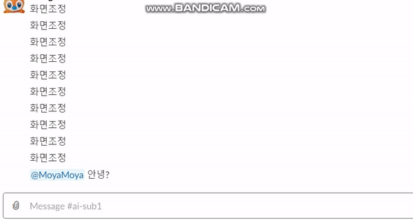
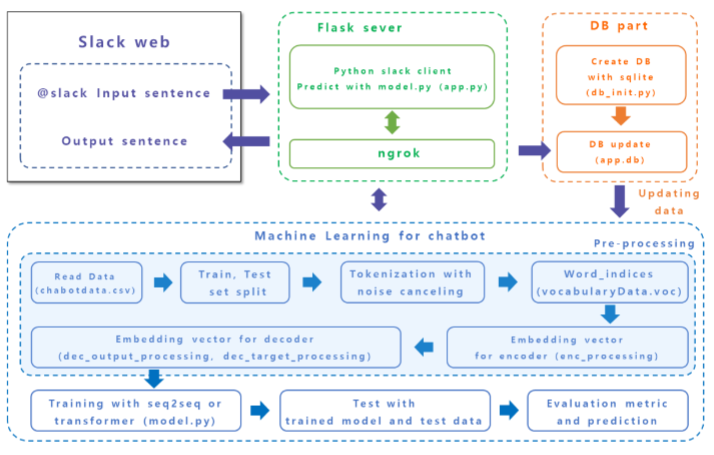

# SSAFY AI/ML 프로젝트 - Sub PJT 3

> ### 딥 러닝 모델을 이용한 챗봇 구현

- 텍스트 전 처리 기법과 머신러닝 기법을 활용

- 딥 러닝 기반의 SLACK app 챗봇 개발

## 팀

- 서울 2반 14조
- 인원
  - **박민형** : Project Manager
      - `Machine Learning Part`, `git Manage Part`
  - **조우현** : Scrum Master
      - `Slack APP Part`, `DB Part`
  - **강민** : Developer
      - `Document & UCC Part`, `Slack APP Part`
  - **김지환** : Developer
      - `Data Processing Part`, `Machine Learning Part`
  - **김준호** : Developer
      - `DB Part`, `Release Part`

## 프리뷰

## 아키텍쳐

## 목표

- 딥 러닝 기술을 구현하기 위하여 그 기반이 되는 `Nueral Network`에 대해 학습.
- 파이썬으로 이를 쉽게 구현해주는 `Tenserflow`를 사용하여 Language Model인 `seq2seq` 모델 구현
- 새로운 텍스트 질문을 입력했을 때 대답을 출력해주는 챗봇을 `Slack App`으로 구현

## 사용환경

- Python 3.6.8 64bit
- SQLite
- Tenserflow
- NLTK
- Rogue
- Visual Studio Code & Pycharm
- Flask server

## 설명

### 머신 러닝 파트

- **Python File I/O**
  - `ChatbotData.csv` 파일을 읽어 트레이닝 데이터와 테스트 데이터로 저장

- **Natural Language Processing & Tokenizing**
  - `prepro_noise_canceling()` : 불필요한 성분 제거
  - `tokenizing_data()` : 문장 데이터 토큰화
  - `load_voc()` : 임베딩을 하기 위한 파일인 `vocabularyData.voc` 생성

- **Data Processing to Encoder and Decoder with Padding**
  - one-hot 인코딩 방식과 유사
  - `enc_processing()` : 인코딩용 전 처리 함수
  - `dec_input_processing()` : 디코더의 입력으로 사용될 입력값을 만드는 함수
  - `dec_target_processing()` : 디코더의 결과로 학습을 위해 필요한 라벨인 타깃값을 만드는 함수
  - padding 방법 :
      - 문장 데이터 길이가 `max_sequence_length` 보다 작은 경우 `PAD데이터` 추가
      - 큰 경우에는 `max_sequence_length`의 길이를 넘는 부분 삭제
  - 임베딩 방법 :
      1. 문장 노이즈 캔슬링
      2. 단어 사전에서 토큰의 index가져오기
      3. Padding하기

- **Learning with seq2seq Model**
  - `seq2seq`
    - 시퀀스 형태의 입력 값을 시퀀스 형태의 출력으로 만드는 모델
    - `RNN(LSTM) cell`기반, `Encoder`부분과 `Decoder`부분으로 나눔
    - `Encoder` : 데이터를 입력 받아 입력 값의 정보를 담은 백터를 생성
    - `Decoder` : 생성된 백터를 활용하여 재귀적으로 출력 값을 생성
  - 학습 및 처리 과정
    1. 질문 데이터는 `train_input_enc`, 대답 데이터는 `train_input_dec`, `train_target_dec`으로 전 처리
    2. `train_input_enc`는 인코더에 입력, 임베딩 과정과 LSTM 다중 셀을 거쳐 `encoder_outputs`, `encoder_states` 출력
    3. `train_input_dec`는 디코더의 인풋으로 사용, state정보인 `encoder_states`를 `decoder_initial_state`로 입력
    4. 디코더는 임베딩 과정과 LSTM 다중 셀을 거쳐 `decoder_outputs`, `decoder_states` 출력
    5. `decoder_outputs`는 dense셀에서 vocabulary_length 크기로 출력되고 argmax과정을 거쳐 제일 높은 확률을 갖는 토큰의 인덱스 획득
    6. 획득한 앤덱스와 `train_target_dec`을 비교한 loss값 계산, `AdamOptimizer`기법 (경사 하강법과 유사)으로 최적화

- **Accuracy measurement**
  - 학습된 결과물을 `BLEU`와 `Rogue`을 사용하여 정확도 판별

### Slack app 구현 파트

- Interactive message
- respond endpoint
- button message
- DB
  - init()
  - getConnection()
  - close()
  - insertData()
  - updateData()
  - selectData()
  - findById()

